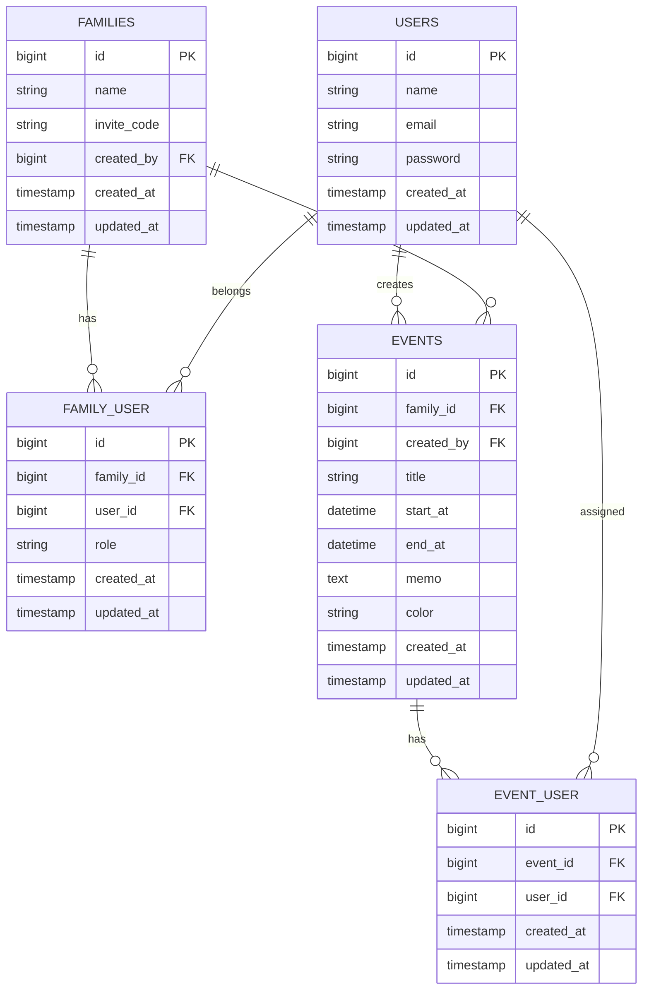

# データベース設計

## 概要

母カレンダーでは、家族グループ内で予定を共有できるようにする。

現時点では、以下の5テーブルを基本構成とする。

- `users`
- `families`
- `family_user`
- `events`
- `event_user`

---

## ER図



---

## テーブルの役割

### users

ユーザー情報を管理する。

主な用途：

- ログイン
- 家族グループへの所属
- 予定の作成者
- 予定の対象者

削除まわり：
- 退会処理として別扱い
- 影響範囲を確認してから削除

---

### families

家族グループを管理する。

例：

- 山本家
- ○○家

主な用途：

- 家族単位で予定を管理する
- 招待コードを使って家族を追加する

削除まわり：
- すぐ削除させない
- 確認ダイアログや条件チェックを入れる

---

### family_user

`users` と `families` の中間テーブル。

「どのユーザーが、どの家族グループに所属しているか」を管理する。

例：

| user_id | family_id | role |
| --- | --- | --- |
| 1 | 1 | owner |
| 2 | 1 | member |
| 3 | 1 | member |

### role

現時点では以下を想定する。

- `owner`
- `member`

将来的に権限を追加する可能性あり。

---

### events

予定を管理する中心テーブル。

例：

- 病院
- ゴミの日
- 家族で食事

`family_id` は「どの家族グループの予定か」を表す。

`created_by` は「誰がその予定を登録したか」を表す。

削除まわり：
- 論理削除
- ゴミ箱から復元可能
- 完全削除も可能

---

### event_user

`events` と `users` の中間テーブル。

「その予定が誰の予定なのか」を管理する。

例：

明音が母の病院予定を登録した場合、

```text
created_by
→ 明音

event_user
→ 母
```

となる。

家族全員の予定の場合は、複数ユーザーを紐付ける。

例：

| event_id | user_id |
| --- | --- |
| 10 | 1 |
| 10 | 2 |
| 10 | 3 |

---

## users テーブル

| カラム | 型 | 内容 |
| --- | --- | --- |
| id | bigint | ユーザーID |
| name | string | 名前 |
| email | string | メールアドレス |
| password | string | パスワード |
| created_at | timestamp | 作成日時 |
| updated_at | timestamp | 更新日時 |

---

## families テーブル

| カラム | 型 | 内容 |
| --- | --- | --- |
| id | bigint | 家族ID |
| name | string | 家族グループ名 |
| invite_code | string | 招待コード |
| created_by | bigint | 家族グループ作成者 |
| created_at | timestamp | 作成日時 |
| updated_at | timestamp | 更新日時 |

---

## family_user テーブル

| カラム | 型 | 内容 |
| --- | --- | --- |
| id | bigint | ID |
| family_id | bigint | 家族ID |
| user_id | bigint | ユーザーID |
| role | string | 家族内での権限 |
| created_at | timestamp | 参加日時 |
| updated_at | timestamp | 更新日時 |

---

## events テーブル

| カラム | 型 | 内容 |
| --- | --- | --- |
| id | bigint | 予定ID |
| family_id | bigint | 家族ID |
| created_by | bigint | 予定作成者 |
| title | string | 予定タイトル |
| start_at | datetime | 開始日時 |
| end_at | datetime | 終了日時 |
| memo | text | メモ |
| color | string | 予定の色 |
| created_at | timestamp | 作成日時 |
| updated_at | timestamp | 更新日時 |

---

## event_user テーブル

| カラム | 型 | 内容 |
| --- | --- | --- |
| id | bigint | ID |
| event_id | bigint | 予定ID |
| user_id | bigint | 予定対象ユーザーID |
| created_at | timestamp | 作成日時 |
| updated_at | timestamp | 更新日時 |

---

## リレーション

### users と families

多対多。

```text
users
  ↓
family_user
  ↓
families
```

---

### families と events

1対多。

```text
family
  ↓
events
```

1つの家族グループに複数の予定を持つ。

---

### users と events（作成者）

1対多。

```text
user
  ↓
events.created_by
```

1人のユーザーが複数の予定を作成できる。

---

### users と events（予定対象者）

多対多。

```text
users
  ↓
event_user
  ↓
events
```

1つの予定に複数のユーザーを紐付けられる。

---

## 現時点では実装しない項目

以下は将来的に追加予定。

- 予定の複製
- お気に入り予定
- 通知
- Googleカレンダー連携
- 共有ON/OFF
- QRコード招待

必要になった段階で、追加テーブルやカラムを検討する。

---

## 今後検討する仕様

- 家族内の予定を全員に表示するか
- 予定対象者だけに表示するか
- 共有ON/OFFをどのように管理するか
- ownerとmemberの権限範囲
- 招待コードの有効期限
- 予定の色を自由入力にするか固定値にするか

